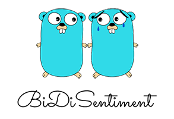
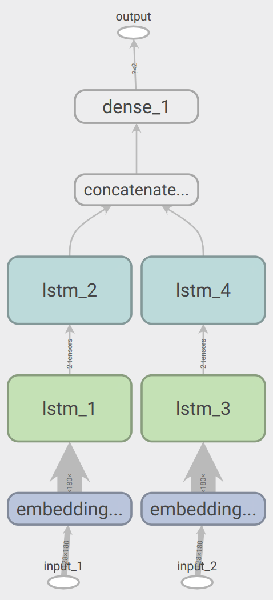
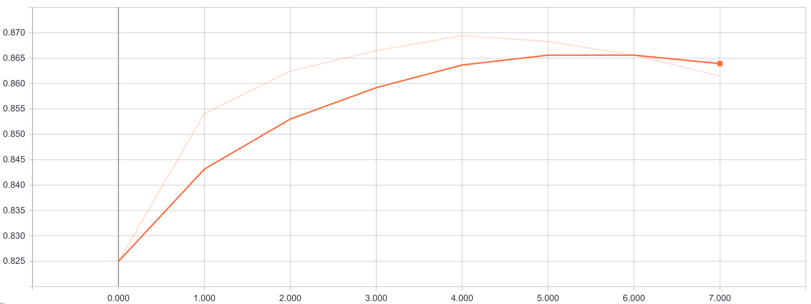

BiDiSentiment [](http://godoc.org/gopkg.in/vmarkovtsev/BiDiSentiment.v1) [](https://travis-ci.org/vmarkovtsev/BiDiSentiment)
=============

Text sentiment analyser for Go and Python.

Runs on top of Tensorflow. The architecture is a bidirectional two-level character LSTM.



Installation of the inference module
------------------------------------

```
go get gopkg.in/vmarkovtsev/BiDiSentiment.v1/...
```

Usage of the inference module
-----------------------------

For every line in stdin, the command line tool prints the probability of the negative sentiment
(the probability of the positive sentiment is 1 - negative).

```
echo "This is the worst movie I have ever seen, it sucks balls!" | sentiment 
0.9961139
echo "This is the best movie I have ever seen, just love it!" | sentiment
0.000769752
```

API expects string batches for performance reasons:

```go
import "gopkg.in/vmarkovtsev/BiDiSentiment.v1"

func main() {
  session, _ := sentiment.OpenSession()
  defer session.Close()
  result, _ := sentiment.Evaluate(
    []string{"This is the best movie I have ever seen, simply love it!"},
    session)
  println(result[0])
}
```

Science
-------



We scan through the text by byte in both directions, and the length is constrained to 180 bytes.
The training is written in Python and is based on Keras and Tensorflow. The achieved accuracy
on 20% validation is **87%**. The train dataset was
[1.5 million tweets](http://thinknook.com/twitter-sentiment-analysis-training-corpus-dataset-2012-09-22/).
The default parameters were used. The model easily overfits, so only the first 5 epochs were used.



Update the model in the Go inference application by executing

```
go-bindata  -nomemcopy -nometadata -pkg assets -o assets/bindata.go  model.pb english.json
```

Contributins
------------
...are welcome! See [CONTRIBUTING.md](CONTRIBUTING.md) and [CODE_OF_CONDUCT.md](CODE_OF_CONDUCT.md).

License
-------

MIT, see [LICENSE](LICENSE).
